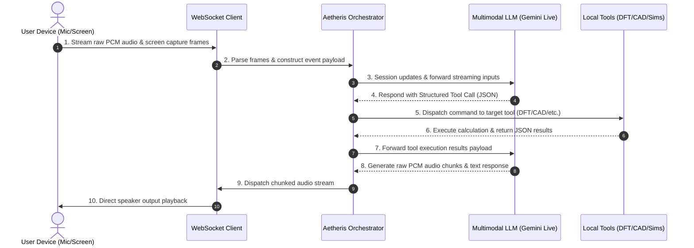
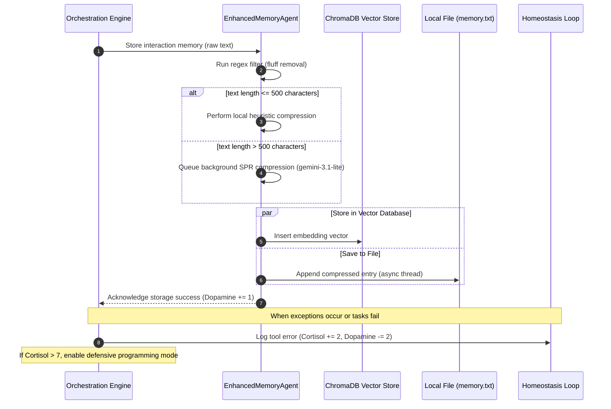

# Aetheris: Figures, Diagrams, and Topological Flowchart Explanations

This document serves as the official companion manual to the **Aetheris** preprint paper. It details the system architectures, topological layouts, and numerical solvers of the framework, providing full explanations for the generated publication figures.

---

## Figure 1: Real-Time Multimodal Function Calling Loop
**File Path:** `figures/live_architecture.png`  


**Description:** Illustrates the high-level multimodal data flow and tool dispatching loop within the Aetheris architecture.



### Explanatory Callouts:
* **Real-time Multimodal Stream (Nodes 1-2):** PyAudio and OpenCV continuously stream PCM audio packets and base64-encoded JPEGs over WebSockets to ensure sub-second latency.
* **Orchestration Loop (Nodes 3-4, 7-8):** Manages connection stability and system history. It communicates with the Gemini Live API session, passing inputs and capturing structured function calls.
* **Structured Tool Execution Bus (Nodes 5-6):** Translates JSON tool schemas directly into function executions inside the sandbox workspace (e.g., triggering the analytical DFT recursion, CAD boundary geometry builds, or FDTD PML damping step).
* **Feedback Response Path (Nodes 9-10):** The model's synthesized audio chunks are played back dynamically to the user, closing the interactive loop.

---

## Figure 2: Asynchronous Memory System and homeostatic Feedback
**File Reference:** (To be generated via system flowchart rendering tools)  
**Description:** Highlights the workflow of the `EnhancedMemoryAgent` during storage and retrieval operations, coupled with the state-shifting homeostatic variables.



### Explanatory Callouts:
* **Fluff Filter:** Strip conversational filler to reduce downstream embedding noise.
* **Dual-Path Storage:** Parallelizing disk writes and ChromaDB insertion ensures low conversational latency.
* **Homeostatic Thresholds:** When the system's stress variable (Cortisol) crosses a critical threshold, prompt templates are modified to enforce strict assertions, type checking, and safety checks.

---

## Figure 3: Density Functional Theory Self-Consistent Field (SCF) Solver
**File Path:** `figures/dft_scf_flowchart.png`  


**Description:** Maps out the iterative cycle of first-principles electronic structure calculations.

```
       +---------------------------------------------+
       |   Input Molecular Geometry & Basis Set      |
       +----------------------+----------------------+
                              |
                              v
       +---------------------------------------------+
       |    Evaluate S, T, V, and ERI Integrals      |
       |  (Obara-Saika / McMurchie-Davidson Schemes) |
       +----------------------+----------------------+
                              |
                              v
       +---------------------------------------------+
       |     Löwdin Symmetric Orthogonalization      |
       |         Matrix: X = S^(-1/2)                |
       +----------------------+----------------------+
                              |
                              v
       +---------------------------------------------+
       |        Initialize Density Matrix P          |
       +----------------------+----------------------+
                              |
                              v
  +--->+---------------------------------------------+
  |    |       Construct Fock / KS Matrix F          |
  |    |   F = H_core + J(P) - 0.5*K(P) + V_xc(P)    |
  |    +----------------------+----------------------+
  |                           |
  |                           v
  |    +---------------------------------------------+
  |    |    DIIS Subspace Acceleration (Pulay)       |
  |    |  Minimize residual error matrix norm ||e||  |
  |    +----------------------+----------------------+
  |                           |
  |                           v
  |    +---------------------------------------------+
  |    |       Orthogonal Diagonalization            |
  |    |     F' = X^T F X  --->  F' C' = C' E        |
  |    +----------------------+----------------------+
  |                           |
  |                           v
  |    +---------------------------------------------+
  |    |       Compute New Density Matrix            |
  |    |         P_new = 2 * C_occ * C_occ^T         |
  |    +----------------------+----------------------+
  |                           |
  |                           v
  |            /¯¯¯¯¯¯¯¯¯¯¯¯¯¯¯¯¯¯¯¯¯¯¯¯¯¯\
  |           <   Is ||P_new - P|| < Tol?  >
  |            \__________________________/
  |                           |
  |                  +--------+--------+
  |               No |                 | Yes
  +------------------+                 v
                               +-------+-------+
                               | Output Wave-  |
                               | functions and |
                               | Total Energy  |
                               +---------------+
```

### Explanatory Callouts:
* **Analytic Integrals:** Overlap ($S$), kinetic energy ($T$), and nuclear attraction ($V$) integrals are calculated analytically. Electron Repulsion Integrals (ERI) are computed using the McMurchie-Davidson algorithm and stored using 8-fold index symmetry.
* **Numerical Grid Integration:** The exchange-correlation potential ($V_{xc}$) is integrated over a multicenter grid using radial Gauss-Chebyshev and angular Lebedev quadratures partitioned with Becke weights.
* **DIIS Subspace Extrapolation:** Minimizes the error matrix $e = FPS - SPF$ by solving a linear system of previous Fock matrices, preventing charge sloshing and speeding up convergence.

---

## Figure 4: Boundary Representation (B-Rep) Topological Hierarchy
**File Path:** `figures/brep_hierarchy.png`  


**Description:** Defines the connectivity and relationships of geometric entities in the CAD kernel.

```
 [Solid] (Closed boundary shell)
    |
    v
 [Shell] (Connected set of faces)
    |
    v
 [Face] (Planar or NURBS surface)
    |
    v
 [Wire] (Closed boundary loop of half-edges)
    |
    v
 [HalfEdge] <===========> [Twin HalfEdge] (Opposite directed segment)
  |   |  |
  |   |  +---> [Vertex] (3D point coordinate origin)
  |   +------> [Edge] (Parent geometric curve)
  +----------> [HalfEdge] (Pointers to next and prev in loop)
```

### Explanatory Callouts:
* **Manifold Topology:** Each edge is shared by exactly two faces and is represented as a pair of opposite `HalfEdges` (`twin` relationship). This structure enables path traversal and Euler characteristic validation.
* **Wire Boundaries:** Wires represent closed loops of half-edges that define outer boundaries or internal holes in a face.
* **Geometric Geometry vs. Topology:** Topology (Vertex, Edge, Face) manages structural relationships, while Geometry (3D point coordinates, lines, NURBS equations) defines the exact spatial dimensions.

---

## Figure 5: 2D FDTD Yee Grid Discretization Schema
**File Path:** `figures/fdtd_yee_grid.png`  


**Description:** Visualizes the spatial arrangement of field components in Yee unit cells for transverse electric electromagnetic waves.

```
       (i, j+1)                              (i+1, j+1)
          o--------------- V ---------------o
          |                                 |
          |                                 |
          |                                 |
          H                                 H
        (i, j+1/2)                        (i+1, j+1/2)
          |                                 |
          |                                 |
          |                                 |
          o--------------- V ---------------o
        (i, j)                             (i+1, j)
                        (i+1/2, j)

    LEGEND:
      o  :  Ez (Electric field, centered at node intersections)
      H  :  Hy (Magnetic field, centered on vertical cell edges)
      V  :  Hx (Magnetic field, centered on horizontal cell edges)
```

### Explanatory Callouts:
* **Staggered Field Components:** The electric field component $E_z$ is placed at grid nodes (integer indices), while the magnetic field components $H_x$ and $H_y$ are placed at half-integer grid indices along the cell edges. This layout allows central difference approximations for Maxwell's curl equations.
* **Courant-Friedrichs-Lewy (CFL) Condition:** Dictates that the temporal step $\Delta t$ must be smaller than the wave propagation time across a single spatial grid step $\Delta x$:
  $$\Delta t \le \frac{1}{c \sqrt{\frac{1}{\Delta x^2} + \frac{1}{\Delta y^2}}}$$
* **PML Boundary Layer:** Implements absorption regions at the grid boundaries to damp outgoing electromagnetic waves without creating artificial reflections back into the simulation domain.

---

## Figure 6: Autonomous Self-Evolution multi-agent workflow
**File Path:** `figures/self_evolution_workflow.png`  


**Description:** Shows the multi-agent execution loop that allows Aetheris to modify its own codebase.

### Phase 1: Diagnostics (Researcher Agent)
* **Goal:** Scans workspace files, examines python dependencies, and logs issues.
* **Output:** Writes a detailed step-by-step modification plan to `surgeon_instructions.txt`.

### Phase 2: Implementation (Surgeon Agent)
* **Goal:** Performs targeted edits based on the instructions.
* **Rule:** Uses line-range search-and-replace strings and regular expressions rather than rewriting files, preventing code loss.

### Phase 3: Verification (Reviewer Agent)
* **Goal:** Evaluates syntax and runs tests on modified files.
* **Feedback:** If syntax errors or import exceptions occur, the Reviewer applies corrections directly. The loop repeats until all tests pass.
